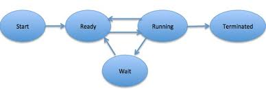
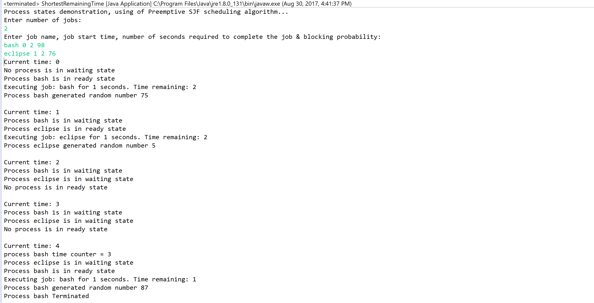
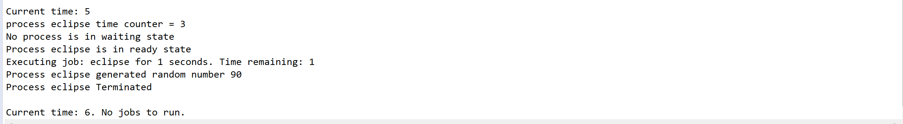

# O.S.-Process-Simulation
### University assignment to simulate the processes using Preemptive shortest job first algorithm and demonstrate process in different process stages

#### Input:
1) Number of jobs
2) job name, arrival time, CPU burst time, Blocking probablity

#### Conditions:

1) Simulation should check for new processes every second of simulation time (iteration).
2) Add a new simulation item – a resource – that processes will randomly attempt to acquire.
   * Therefore,
      * Track each process’s state: ready (in the ready queue), blocked (waiting to access
         the resource), and running.
      * The resource itself will require a queue, and serve processes in a first-come-first-serve
        manner.
      * When reading the initial data for the simulation, for each process, read in, 
        a blocking probability p. This is a number between 1 and 100. Each second of simulation 
        time the process is running, generate a random number between 1 and 100 (inclusive). If 
        the number is less than or equal to p, then set the process to blocked state, and insert
        it into the queue to wait for the resource.
      * Once a process has been served by the resource (i.e. it has been popped from the resource’s
        queue), set its state to ready, and insert it back into the ready queue. Do this every 3 seconds
        (assume IO takes a lot of time).
      
#### Representation of Process states:
 
#### Output:
 
 

#### _This is a University of Windsor Operating system course assignment (03-60-330). Copying it in future could lead to plagiarism issues. Please do not copy it!!!_
